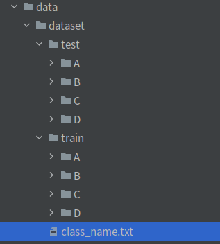

# PyTorch-NLP-Trainer

## 1.介绍

基于PyTorch的自然语言处理(NLP)训练框架,可用于训练文本分类器

## 2.安装

- 依赖Python包：[requirements.txt](./requirements.txt)

```bash
# 先安装Anaconda3
# 在conda新建虚拟环境pytorch-py36(如果已经存在，则无需新建)
conda create -n pytorch-py36 python==3.6.7
# 激活虚拟环境pytorch-py36(每次运行都需要运行)
conda activate  pytorch-py36
# 安装工程依赖的包(如果已经安装，则无需安装)
pip install -r requirements.txt
```

## 3.数据：准备Train和Test数据

- Train和Test数据集，要求相同类别的文本，放在同一个文件夹下；且子目录文件夹命名为类别名称



- 类别文件：一行一个列表： [class_name.txt](data/dataset/class_name.txt) (最后一行,请多回车一行)


- 修改配置文件数据路径：[config.yaml](configs/config.yaml)

```yaml
train_data: # 可添加多个数据集
  - 'data/dataset/train'
  - 'data/dataset/train2'
test_data: 'data/dataset/test'
class_name: 'data/dataset/class_name.txt'
```

## 4.训练

```bash
python train.py -c configs/config.yaml 
```

- 目标支持模型主要有：TextCNN,LSTM,BiLSTM等，详见[模型](core/models/build_models.py)等 ，其他模型可以自定义添加
- 训练参数可以通过[config.yaml](configs/config.yaml)配置文件

| **参数**      | **类型**      | **参考值**   | **说明**                                       |
|:-------------|:------------|:------------|:---------------------------------------------|
| train_data   | str, list   | -           | 训练数据文件，可支持多个文件                               |
| test_data    | str, list   | -           | 测试数据文件，可支持多个文件                               |
| vocab_file   | str         | -           | 字典文件(会根据训练数据集自动生成)                 |
| class_name   | str         | -           | 类别文件                               |
| data_type    | str         | -           | 加载数据DataLoader方法                               |
| resample     | bool        | True        | 是否进行重采样                              |
| work_dir     | str         | work_space  | 训练输出工作空间                                     |
| net_type     | str         | TextCNN     | 骨干网络,支持：TextCNN,LSTM,BiLSTM等 |
| context_size | int         | 128         | 句子长度 |
| topk         | list        | [1,3,5]     | 计算topK的准确率 |
| batch_size   | int         | 32          | 批训练大小                                   |
| lr           | float       | 0.1         | 初始学习率大小                                      |
| optim_type   | str         | SGD         | 优化器，{SGD,Adam}                               |
| loss_type    | str         | CELoss      | 损失函数                                         |
| scheduler    | str         | multi-step  | 学习率调整策略，{multi-step,cosine}                  |
| milestones   | list        | [30,80,100] | 降低学习率的节点，仅仅scheduler=multi-step有效            |
| momentum     | float       | 0.9         | SGD动量因子                                      |
| num_epochs   | int         | 120         | 循环训练的次数                                      |
| num_workers  | int         | 12          | DataLoader开启线程数                              |
| weight_decay | float       | 5e-4        | 权重衰减系数                                       |
| gpu_id       | list        | [ 0 ]       | 指定训练的GPU卡号，可指定多个                             |
| log_freq     | int         | 20          | 显示LOG信息的频率                                   |
| finetune     | str         | model.pth   | finetune的模型                                  |


## 5.测试Demo

- 先修改[demo.py](demo.py)


- 然后运行demo.py

```bash
python demo.py
```

## 6.可视化

目前训练过程可视化工具是使用Tensorboard，使用方法：

```bash
tensorboard --logdir=path/to/log/
```

## 7.数据集

- pytorch 实现 textCNN: https://blog.csdn.net/qsmx666/article/details/105302858
- wiki中文语料的word2vec模型构建：https://www.cnblogs.com/always-fight/p/10310418.html
- 《最全中文自然语言处理数据集、平台和工具整理》https://zhuanlan.zhihu.com/p/70355773
- 参考资料：https://github.com/L1aoXingyu/code-of-learn-deep-learning-with-pytorch/blob/master/chapter5_RNN/nlp/word-embedding.ipynb
- 《PyTorch搭建N-gram模型实现单词预测》https://github.com/L1aoXingyu/code-of-learn-deep-learning-with-pytorch/blob/master/chapter5_RNN/nlp/n-gram.ipynb
- 《PyTorch搭建N-gram模型实现单词预测》https://blog.csdn.net/Answer3664/article/details/90666454


## 8.其他

| 作者        | PKing               |
|:------------|:--------------------|
| 联系方式    | pan_jinquan@163.com | 

